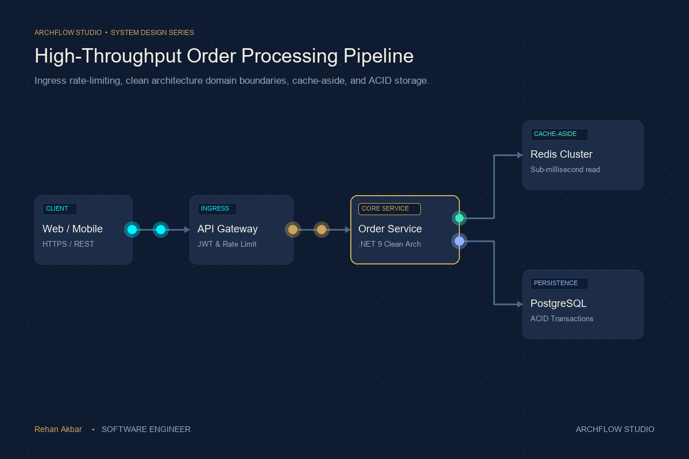
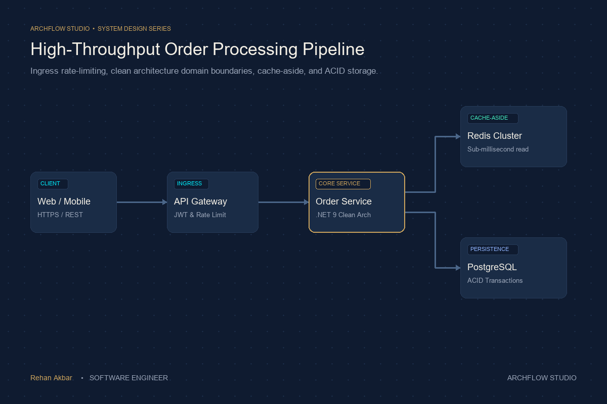

<div align="center">

# ⚡ ArchFlow Studio

### Turn static architecture diagrams into eye-catching animated flow animations.

Overlay smooth, glowing, moving dots along the arrows and connector lines of your cloud diagrams, microservices, API workflows, and system architectures.

[](LICENSE)
[](#-part-2-python-cli-guide-for-developers--power-users)
[](#-part-1-the-visual-web-studio-beginner-friendly--zero-coding)
[](skills/archflow-studio/SKILL.md)

[🚀 3-Minute Quick Start](#-3-minute-quick-start) · [🖥️ Visual Web Studio Tutorial](#-part-1-the-visual-web-studio-beginner-friendly--zero-coding) · [💻 Python CLI Guide](#-part-2-python-cli-guide-for-developers--power-users) · [📐 Understanding Coordinates](#-understanding-coordinates-and-routes) · [⌨️ Keyboard Shortcuts](#-keyboard-shortcuts-reference) · [❓ FAQ & Troubleshooting](#-frequently-asked-questions--troubleshooting)

<br/>



**Your diagram artwork stays 100% still, sharp, and readable. The moving dots tell the story of your data.**

</div>

---

## 📖 Table of Contents

1. [What is ArchFlow Studio?](#-what-is-archflow-studio)
2. [Before and After: What Does It Look Like?](#-before-and-after-what-does-it-look-like)
3. [3-Minute Quick Start](#-3-minute-quick-start)
4. [Part 1: The Visual Web Studio (Beginner Friendly & Zero Coding)](#-part-1-the-visual-web-studio-beginner-friendly--zero-coding)
   - [Step 1: Open the Studio](#step-1-open-the-studio)
   - [Step 2: Choose or Upload a Diagram](#step-2-choose-or-upload-a-diagram)
   - [Step 3: Draw Your First Flow Line (Point-and-Click)](#step-3-draw-your-first-flow-line-point-and-click)
   - [Step 4: Customize Dot Color, Speed, and Glow](#step-4-customize-dot-color-speed-and-glow)
   - [Step 5: Adjust Points with Drag-and-Drop](#step-5-adjust-points-with-drag-and-drop)
   - [Step 6: Export Your Finished Animation](#step-6-export-your-finished-animation)
5. [Enterprise Cloud Architecture Walkthrough](#-enterprise-cloud-architecture-walkthrough)
6. [Part 2: Python CLI Guide (For Developers & Power Users)](#-part-2-python-cli-guide-for-developers--power-users)
   - [Prerequisites & Installation](#prerequisites--installation)
   - [Command 1: Preview Alignment](#1-preview-alignment)
   - [Command 2: Render Looping GIF](#2-render-looping-gif)
   - [Command 3: Render Crisp MP4 Video](#3-render-crisp-mp4-video)
7. [📐 Understanding Coordinates and Routes](#-understanding-coordinates-and-routes)
8. [🎨 Visual Design System & LinkedIn Architecture Guidelines](#-visual-design-system--linkedin-architecture-guidelines)
9. [⌨️ Keyboard Shortcuts Reference](#-keyboard-shortcuts-reference)
10. [❓ Frequently Asked Questions & Troubleshooting](#-frequently-asked-questions--troubleshooting)
11. [📄 License & Credits](#-license--credits)

---

## 💡 What is ArchFlow Studio?

When you explain system architecture on **LinkedIn**, in a **technical blog post**, or during a **team presentation**, a static picture with frozen arrows doesn't convey how data actually moves.

Normally, animating arrows requires learning complex video software like Adobe After Effects or Blender. **ArchFlow Studio makes it effortless**:

* **Upload any image**: Export your architecture diagram from draw.io, Excalidraw, Lucidchart, Figma, or Canva as a PNG or JPEG.
* **Click along the arrows**: Click where the line starts, where it bends, and where it ends.
* **Watch it come alive**: Glowing dots automatically glide along the path at 60 frames per second.
* **Export in seconds**: Download an animated **MP4/WebM video** or high-quality **GIF** ready to post on social media or embed in your documentation!

---

## 🚀 Before and After: What Does It Look Like?

| 1. Your Original Static Diagram | 2. With ArchFlow Studio Motion |
| :---: | :---: |
|  |  |
| *All text, icons, boxes, and lines stay 100% crisp.* | *Smooth glowing dots show requests, caching, and database writes.* |

---

## ⚡ 3-Minute Quick Start

Choose the method that fits you best:

```
┌────────────────────────────────────────────────────────────────────────┐
│  WHICH METHOD SHOULD YOU USE?                                          │
├──────────────────────────────────────┬─────────────────────────────────┤
│  🖥️ METHOD 1: VISUAL WEB STUDIO     │  💻 METHOD 2: PYTHON CLI        │
│  - No coding required                │  - For batch rendering          │
│  - Point-and-click route drawing     │  - Scriptable & automated       │
│  - Instant 60 FPS live preview       │  - Two-pass palette GIFs        │
│  - 1-click video download            │  - High-bitrate H.264 MP4       │
│  👉 Recommended for Beginners        │  👉 For Developers & Automation │
└──────────────────────────────────────┴─────────────────────────────────┘
```

---

## 🖥️ Part 1: The Visual Web Studio (Beginner Friendly & Zero Coding)

The Web Studio is a complete visual app that runs right in your web browser. You don't need to write any code or install any video software.

### Step 1: Open the Studio

You have two easy ways to open it:

#### Option A: Run a Local Web Server (Recommended)
Open your terminal (PowerShell, Command Prompt, or Terminal) in the `archflow-studio` directory and type:
```powershell
python -m http.server 8080
```
Then open your web browser and go to:
👉 **[http://localhost:8080/web-studio/](http://localhost:8080/web-studio/)**

#### Option B: Open Directly from File Explorer
1. Navigate to the `archflow-studio/web-studio/` folder on your computer.
2. Double-click the file named `index.html`.
3. It will open instantly in your default web browser (Chrome, Edge, Firefox, or Safari).

---

### Step 2: Choose or Upload a Diagram

When the Web Studio opens, you can either explore the pre-loaded enterprise architecture or use your own image:

* **To try the pre-loaded architecture**: Click **Cloud Architecture (Rehan)** in the top navigation bar to load the complete enterprise cloud pipeline.
* **To use your own diagram**: Click the **Upload Diagram** button in the top left, and select any `.png`, `.jpg`, or `.svg` file from your computer.

> [!TIP]
> **Recommended diagram dimensions**: For best results, use an image between `1200x800` (landscape) or `1080x1350` (portrait 4:5 for LinkedIn/Instagram).

---

### Step 3: Draw Your First Flow Line (Point-and-Click)

Drawing an animated path is as simple as clicking where data travels:

1. In the left toolbar, click the **Add Route** button (or press the **`P`** key on your keyboard).
2. Move your mouse over the diagram:
   * **Click 1**: Click on the starting point (for example, on the *Client* icon).
   * **Click 2, 3, etc.**: If your line bends around a corner, click once at each corner.
   * **Click Final**: Click right at the arrowhead where the line ends (for example, at the *API Gateway*).
3. Complete the line by doing **any one** of these:
   * Press **`Enter`** on your keyboard, OR
   * Double-click on the last point, OR
   * Click the blue **Done Route** button in the left sidebar.
4. **Boom!** A glowing dot instantly begins flowing continuously along that line.

```
How to place points:

[Client] ───── Click 1 (Start)
                 │
                 │
                 └─── Click 2 (Corner)
                        │
                        ▼
                   [Database] ───── Click 3 (End) -> Press Enter!
```

---

### Step 4: Customize Dot Color, Speed, and Glow

Click on any route in the right sidebar (or click on its line on the canvas) to open the **Properties Panel**. Here is what you can customize:

| Property | What It Does | Recommended Value |
| :--- | :--- | :--- |
| **Color** | The color of the glowing dot. Click the colored circle to pick any color, or use our quick presets. | `#00F0FF` (Teal) or `#CBA35C` (Gold) |
| **Speed (px/s)** | How fast the dot moves along the line in pixels per second. | `160 - 240 px/s` for normal flow, `320+ px/s` for fast caches |
| **Dot Count** | How many dots travel along the route at the same time. Setting this to `2` or `3` creates a continuous stream of packets! | `2` or `3` dots |
| **Diameter** | How large the dot is in pixels. | `12 - 18 px` |
| **Neon Glow** | Adds a bright, luminous halo around the dot, making it pop on dark backgrounds. | Turn **ON** for dark diagrams |
| **Comet Trail** | Leaves a fading particle tail behind the dot as it travels. | `15 - 30 px` |
| **Reverse Flow** | Reverses the direction of movement if the dots are flowing backwards! | Click if arrows point the other way |

---

### Step 5: Adjust Points with Drag-and-Drop

If you placed a point slightly off-center:

1. Click **Select Mode** in the left sidebar (or press **`V`**).
2. Click on the route you want to adjust.
3. You will see white circular handles appear at every point.
4. **Click and drag** any handle to line it up perfectly with your diagram's arrow!

---

### Step 6: Export Your Finished Animation

When you are happy with how your animation looks:

#### 1. Export Video (1-Click Browser Download)
* Click the green **Export Video** button in the top-right corner.
* The studio will automatically record one perfect loop and download an `archflow-animation.webm` file straight to your computer's *Downloads* folder.
* **No extra software, command line, or FFmpeg installation required!**

#### 2. Export JSON Configuration
* Click **Export JSON** to download a `routes.json` file.
* This file contains all your route coordinates. You can load it back into the Web Studio anytime (using **Import JSON**) or use it with the Python CLI to render a high-quality GIF.

---

## 🧪 Enterprise Cloud Architecture Walkthrough

ArchFlow Studio comes bundled with a complete production cloud architecture example in [`examples/`](examples/):


### Diagram Breakdown:
1. **Route 1: Client Ingress ➔ API Gateway**
   * **Color**: `#00F0FF` (Teal Cyan)
   * **Speed**: `220 px/s` | **Dot Count**: `2`
   * **Story**: Shows external HTTPS user requests hitting the cloud boundary.
2. **Route 2: API Gateway ➔ Order Service**
   * **Color**: `#CBA35C` (Muted Gold)
   * **Speed**: `240 px/s` | **Dot Count**: `2`
   * **Story**: Shows validated requests entering the core business logic.
3. **Route 3: Order Service ➔ Redis Cache (Cache Check)**
   * **Color**: `#43E8BD` (Mint Teal)
   * **Speed**: `340 px/s` (Fast!) | **Dot Count**: `1`
   * **Story**: High-speed, low-latency in-memory cache lookup.
4. **Route 4: Order Service ➔ PostgreSQL (Persistence)**
   * **Color**: `#90B5FF` (Soft Blue)
   * **Speed**: `160 px/s` (Slower) | **Dot Count**: `1`
   * **Story**: Demonstrates durable disk write operations. The speed contrast between Redis (`340 px/s`) and Postgres (`160 px/s`) instantly explains the latency difference to your audience!

> [!TIP]
> You can load this exact project into the Web Studio with one click by pressing the **Cloud Architecture (Rehan)** button in the header!

---

## 💻 Part 2: Python CLI Guide (For Developers & Power Users)

If you prefer using the command line or want to automatically batch-generate high-quality **two-pass palette GIFs** and **H.264 MP4 videos**, use the Python engine.

### Prerequisites & Installation

1. **Python 3.10 or higher** must be installed on your computer.
2. **FFmpeg** must be installed and added to your system PATH:
   * **Windows**: Run `winget install Gyan.FFmpeg` in PowerShell.
   * **macOS**: Run `brew install ffmpeg` in Terminal.
   * **Linux (Ubuntu/Debian)**: Run `sudo apt update && sudo apt install ffmpeg`.

### Step-by-Step Setup

```powershell
# 1. Clone or navigate to the repository
cd "path/to/archflow-studio"

# 2. Create a Python virtual environment
python -m venv .venv

# 3. Activate the virtual environment:
# On Windows (PowerShell):
.venv\Scripts\Activate.ps1
# On macOS / Linux:
source .venv/bin/activate

# 4. Install the required dependencies (Pillow, etc.)
pip install -r skills/archflow-studio/requirements.txt
```

---

### 1. Preview Alignment

Before rendering a full animation, generate a diagnostic preview image. This overlays numbered lines and dots onto your diagram so you can verify that your coordinates line up with your arrows:

```powershell
python skills/archflow-studio/scripts/archflow.py preview `
  --image examples/architecture.png `
  --config examples/routes.json `
  --output output/preview.png `
  --force
```

Open `output/preview.png` to inspect your paths.

---

### 2. Render Looping GIF

Render a lightweight, looping GIF optimized using FFmpeg's two-pass color palette:

```powershell
python skills/archflow-studio/scripts/archflow.py render `
  --image examples/architecture.png `
  --config examples/routes.json `
  --output output/architecture-flow.gif `
  --format gif `
  --force
```

---

### 3. Render Crisp MP4 Video

Render an H.264 video with `yuv420p` pixel format, compatible with all social media platforms (LinkedIn, Twitter/X, YouTube Shorts):

```powershell
python skills/archflow-studio/scripts/archflow.py render `
  --image examples/architecture.png `
  --config examples/routes.json `
  --output output/architecture-flow.mp4 `
  --format mp4 `
  --force
```

---

## 📐 Understanding Coordinates and Routes

If you want to create or edit a `routes.json` file manually, here is what the format looks like:

```json
{
  "image_size": [1200, 800],
  "frames": 120,
  "delay_ms": 30,
  "defaults": {
    "speed": 220,
    "diameter": 16,
    "color": "#00F0FF",
    "glow": true
  },
  "routes": [
    {
      "id": "client-to-api",
      "points": [
        [230, 400],
        [330, 400]
      ],
      "color": "#00F0FF",
      "dot_count": 2,
      "speed": 220
    },
    {
      "id": "api-to-cache",
      "points": [
        [510, 400],
        [600, 400],
        [600, 270],
        [750, 270]
      ],
      "color": "#43E8BD",
      "speed": 340
    }
  ]
}
```

### Explaining the Fields:

* **`image_size`**: `[width, height]` in pixels. Must match the exact resolution of your diagram image (e.g. `[1200, 800]`).
* **`frames`**: Total number of frames in one full loop (typically `90` to `150`).
* **`delay_ms`**: Milliseconds per frame. `30` gives roughly 33 frames per second.
* **`points`**: A list of `[X, Y]` coordinate pairs:
  * `[0, 0]` is the **top-left corner** of your image.
  * `X` increases as you move **right**.
  * `Y` increases as you move **down**.
  * For a straight line: provide `2` points `[ [startX, startY], [endX, endY] ]`.
  * For a line that turns corners: provide each corner point in order.
* **`color`**: Hex color code for the dot (e.g. `"#00F0FF"`).
* **`speed`**: Velocity in pixels per second.
* **`dot_count`**: Number of simultaneous dots traveling along the route.
* **`glow`**: `true` or `false` to enable a luminous neon outer halo.
* **`trail`**: Length of the fading comet tail in pixels (e.g. `20`).
* **`reverse`**: `true` if you want the dot to travel from the last point to the first point.

---

## 🎨 Visual Design System & LinkedIn Architecture Guidelines

When sharing software architecture on **LinkedIn**, in **technical blogs**, or at **engineering conferences**, your visuals must communicate complex engineering concepts with instant clarity and professional elegance.

### 1. Strict Aspect Ratio Guidelines

```
┌────────────────────────────────────────────────────────────────────────┐
│  FORMAT RULES FOR SOCIAL MEDIA & TECHNICAL BLOGS                       │
├───────────────────────┬───────────────────┬────────────────────────────┤
│  Aspect Ratio         │  Resolution       │  Where to Use              │
├───────────────────────┼───────────────────┼────────────────────────────┤
│  📱 Portrait (4:5)    │  1080 × 1350 px   │  DEFAULT for LinkedIn feed │
│                       │                   │  Maximizes mobile screen   │
│                       │                   │  space and stops scrolling │
├───────────────────────┼───────────────────┼────────────────────────────┤
│  🖥️ Landscape (16:9)  │  1920 × 1080 px   │  Engineering Blogs,        │
│                       │  (or 1200 × 800)  │  Slide Decks, Desktop docs │
└───────────────────────┴───────────────────┴────────────────────────────┘
```

* **Portrait (`4:5`, 1080 × 1350 px)**: **Default for LinkedIn**. Most engineers read LinkedIn on their smartphones. A 4:5 vertical graphic commands maximum screen height, drawing instant attention to your architecture.
  * *Layout*: Bold headline in the upper third, animated architecture visual in the center, minimal author signature at the bottom.
* **Landscape (`16:9`, 1920 × 1080 px or 1200 × 800 px)**: Used for blog posts, documentation, and technical presentations.
  * *Layout*: Headline and core takeaway on the left (40%), animated architecture flow on the right (60%).

---

### 2. The 3-Second Visual Composition Contract

* **⚡ 3-Second Comprehension**: The core architectural lesson (e.g. *“Redis cache prevents database exhaustion”*) must be understood within 3 seconds of looking at the graphic.
* **🎯 One Strong Visual**: Present only ONE central technical flow per diagram (e.g., *Gateway ➔ Order Service ➔ Cache ➔ Database*). Avoid overwhelming spaghetti diagrams.
* **💨 Generous Whitespace**: Keep at least 30–40% breathing room around components. Generous margins create a premium, calm, editorial aesthetic.
* **✍️ Author Branding**:
  ```text
  Rehan Akbar
  SOFTWARE ENGINEER
  ```
  Positioned clean and minimal at the bottom-left or bottom-center.

---

### 3. Signature Editorial Color Tokens

ArchFlow Studio is built around a curated dark-mode editorial palette that makes glowing neon flow dots stand out with luminous clarity:

```
┌────────────────────────────────────────────────────────────────────────┐
│  SIGNATURE EDITORIAL ARCHITECTURE PALETTE                              │
├───────────────┬───────────┬────────────────────────────────────────────┤
│  Layer        │  Hex Code │ Role & Usage                               │
├───────────────┼───────────┼────────────────────────────────────────────┤
│  Canvas       │  #0F1B30  │ Deep Navy diagram background               │
│  Panels/Cards │  #1A2C46  │ Service & component container boxes        │
│  Borders      │  #263A58  │ Subtle architectural divider lines         │
│  Primary Text │  #F4F0E6  │ Warm Cream component titles and labels     │
│  Muted Text   │  #9AA5B8  │ Soft Blue-Gray subtitles and metrics       │
│  Teal Cyan    │  #00F0FF  │ Ingress flow dots & public API routes      │
│  Muted Gold   │  #CBA35C  │ Core domain microservices & business logic │
│  Mint Teal    │  #43E8BD  │ In-memory caching layers (Redis, Memcached)│
│  Soft Blue    │  #90B5FF  │ Relational persistence (PostgreSQL, SQL)   │
└───────────────┴───────────┴────────────────────────────────────────────┘
```

---

### 4. Motion Storytelling Techniques

1. **Demonstrate Latency with Speed Contrast**:
   - Make cache reads move rapidly (`340 px/s`).
   - Make disk database writes move at a measured, deliberate pace (`160 px/s`).
   - *Result: Your audience instantly understands the 10x latency difference between RAM and disk without reading any text.*
2. **Show Traffic Volume with Multi-Dot Streams**:
   - Set `dot_count: 2` or `3` on high-throughput ingress endpoints.
   - Set `dot_count: 1` on background sync or batch jobs.
3. **Enhance Depth with Neon Glow**:
   - Enable `"glow": true` on dark backgrounds to give dots a luminous aura that mimics real data traveling through optical fibers or network backbones.

---

## ⌨️ Keyboard Shortcuts Reference

Work faster in the Web Studio with these built-in hotkeys:

| Key | Action | Description |
| :---: | :--- | :--- |
| **`P`** | **Pen / Add Route** | Start drawing a new route path |
| **`V`** | **Select / Edit** | Select routes and drag point handles |
| **`Enter`** | **Finish Route** | Complete the current route being drawn |
| **`Esc`** | **Cancel / Deselect** | Cancel the active route drawing or deselect current route |
| **`Space`** | **Play / Pause** | Pause or resume the animation canvas |
| **`Delete`** / **`Backspace`** | **Delete Route** | Delete the currently selected route |

---

## ❓ Frequently Asked Questions & Troubleshooting

#### Q: How do I turn the exported video into a GIF for LinkedIn?
> **Answer**: You have two easy options:
> 1. Use the Python CLI command: `python skills/archflow-studio/scripts/archflow.py render --image your_diagram.png --config routes.json --output your_flow.gif`.
> 2. Or upload the `.webm` file downloaded from the Web Studio to any free converter like [ezgif.com/video-to-gif](https://ezgif.com/video-to-gif).

#### Q: My dots are flowing backwards in the opposite direction of the arrow!
> **Answer**: In the Web Studio, click on the route in the right sidebar and click the **Reverse Flow** button. If you are editing JSON, simply add `"reverse": true` to that route.

#### Q: Can I draw curved lines instead of sharp corners?
> **Answer**: Yes! In the Web Studio, click 4 to 6 points gently along your curved line. The animation engine connects them into a smooth polyline path that the dot follows naturally.

#### Q: The Python script says `ffmpeg is not installed or not in PATH`. What do I do?
> **Answer**: 
> * If you are on Windows, open PowerShell as Administrator and run: `winget install Gyan.FFmpeg`. Then restart your terminal.
> * Alternatively, you don't need FFmpeg at all if you use the **Web Studio** (`http://localhost:8080/web-studio/`), which exports directly in your browser!

#### Q: Can I use this for diagrams made in draw.io, Excalidraw, or Canva?
> **Answer**: Yes! Export your diagram as a high-resolution PNG or SVG image from any diagramming tool, click **Upload Diagram** in the Web Studio, and draw your paths.

---

## 🧪 Automated Unit Testing

ArchFlow Studio includes automated unit tests covering coordinate interpolation, Bézier curves, phase offsets, and configuration validation.

To run the test suite (make sure your virtual environment `.venv` is activated):
```powershell
# With virtual environment activated:
python -m unittest discover -s tests -v

# Or directly using the virtual environment python:
# On Windows:
.venv\Scripts\python -m unittest discover -s tests -v
# On macOS / Linux:
.venv/bin/python -m unittest discover -s tests -v
```

Output:
```
test_bezier_sampling (test_archflow.ArchFlowTests.test_bezier_sampling) ... ok
test_multidot_phase_offset (test_archflow.ArchFlowTests.test_multidot_phase_offset) ... ok
test_normalize_config_validates_routes (test_archflow.ArchFlowTests.test_normalize_config_validates_routes) ... ok
test_position_at_corners_and_interpolation (test_archflow.ArchFlowTests.test_position_at_corners_and_interpolation) ... ok

----------------------------------------------------------------------
Ran 4 tests in 0.001s

OK
```

---

## 📄 License & Credits

* Released under the open-source [MIT License](LICENSE).
* Architecture and implementation designed by **Rehan Akbar** ([GitHub](https://github.com/rehan67)).
